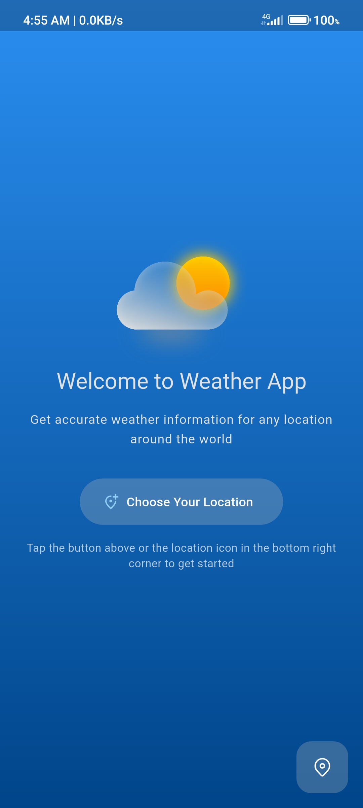
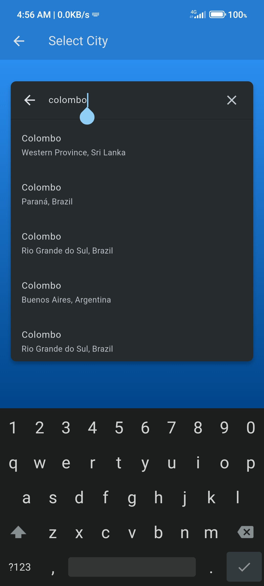
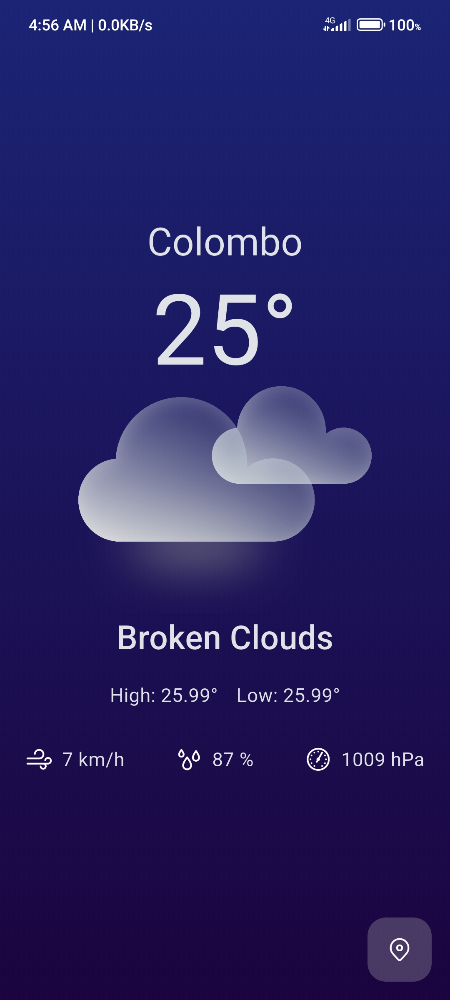
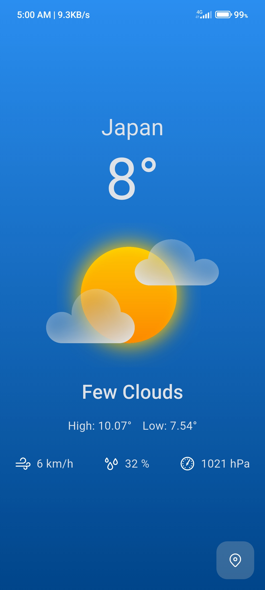

# Weather App

A beautiful Flutter application that provides real-time weather information for locations around the world.

## Features

 - Real-Time Weather Data – Get current temperature, conditions, and atmospheric details.
 -  Location Search – Search for cities worldwide with accurate suggestions.
 -  Saved Locations – Automatically remembers your last selected location.
 -  Connectivity Check – Detects internet connectivity and provides feedback.
 -  Dynamic UI – Backgrounds change based on weather conditions.
 -  Smooth Animations – Shimmer effect while loading data.

## Screenshots

<table> 
<tr>
<td></td>  <td></td>
<td></td>
</tr>
<tr>
<td></td> 
<td></td> 
<td></td> </tr> </table>

## Technologies Used
 - Flutter: Cross-platform UI framework
 - BLoC Pattern: State management using the BLoC architecture
 - OpenWeatherMap API: Weather data source
 - Shimmer: Loading animation effects
 - Shared Preferences: Local storage for saved locations
 - Connectivity Plus: Internet connection detection

## Getting Started

### Prerequisites
 - Flutter SDK (3.0 or later)
 - Dart SDK
 - OpenWeatherMap API key

### Installation

1. Clone the repository:
```bash
   git clone https://github.com/Ramith-Gunawardana/weather-app.git
```
2. Navigate to the project directory:
```bash
    cd weather-app
```
3. Create a `.env` file in the root directory and add your OpenWeatherMap API key:
```
    API_KEY=your_api_key_here
```
4. Install dependencies:
```bash
    flutter pub get
```
5. Run the app:
```bash
    flutter run
```
## Project Structure
```
lib/ 
│── blocs/ # BLoC state management files 
│   │── location_bloc/ # Handles location search functionality 
│   │── storage_bloc/ # Manages saved location data 
│   └── weather_bloc/ # Handles weather data fetching and states 
│── models/ # Data models for locations and weather 
│── repository/ # API communication and data handling 
│── screens/ # UI screens 
│── services/ # Utility services for connectivity, storage, etc. 
│── utils/ # Helper utilities  
└── main.dart # Application entry point
```
## Dependencies
<table>
  <thead>
    <tr>
      <th>Package</th>
      <th>Description</th>
    </tr>
  </thead>
  <tbody>
    <tr>
      <td><a href="https://pub.dev/packages/http">http</a></td>
      <td>Package for making HTTP requests to fetch weather data</td>
    </tr>
    <tr>
      <td><a href="https://pub.dev/packages/flutter_dotenv">flutter_dotenv</a></td>
      <td>Securely load API Key from .env file</td>
    </tr>
    <tr>
      <td><a href="https://pub.dev/packages/flutter_bloc">flutter_bloc</a></td>
      <td>State management solution implementing the BLoC pattern</td>
    </tr>
    <tr>
      <td><a href="https://pub.dev/packages/equatable">equatable</a></td>
      <td>Simplifies equality comparisons for classes</td>
    </tr>
    <tr>
      <td><a href="https://pub.dev/packages/shared_preferences">shared_preferences</a></td>
      <td>Persistent storage for saving user locations</td>
    </tr>
    <tr>
      <td><a href="https://pub.dev/packages/shimmer">shimmer</a></td>
      <td>Creates shimmering loading effect animations</td>
    </tr>
    <tr>
      <td><a href="https://pub.dev/packages/connectivity_plus">connectivity_plus</a></td>
      <td>Network connectivity detection and monitoring</td>
    </tr>
    <tr>
      <td><a href="https://pub.dev/packages/flutter_launcher_icons">flutter_launcher_icons</a></td>
      <td>Customizes app launcher icons</td>
    </tr>
  </tbody>
</table>


## State Management

The app uses the BLoC pattern with several state classes:
 - WeatherState: Initial, Loading, Loaded, Error
 - StorageState: Initial, Loading, Loaded, Saved, Error
 - LocationState: Initial, Loading, Loaded, Error

## Acknowledgements

 - [OpenWeatherMap](https://openweathermap.org/) for the weather data API
 - [Flutter](https://flutter.dev/) and its community for the amazing framework
 - [Glassmorphism Weather Icons](https://www.figma.com/community/file/1283826005232351466) by Ilyas Mrayan
 - Icons made by [Icons8](https://icons8.com/)

 ## License

This project is licensed under the Apache License 2.0. See the [LICENSE](LICENSE) file for details.
